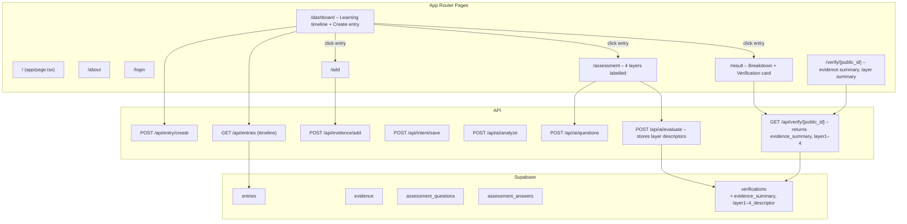

# Lighthouse Ledger — System Analysis & Gap Report

**Note:** No master spec documents (PRD, executive summary, brand system, UX flows) were found in this repo. The “intended” product is reconstructed from: README, AI prompts in `prompts/`, API types in `types/api.ts`, and observed behaviour in the codebase. Where the task referenced intended design (e.g. four-layer rubric, evidence-first flow, brand rules), those are noted as task-stated intent.

---

## 1. Mermaid diagram of the current system

```mermaid
flowchart TB
  subgraph Pages["App Router Pages"]
    HOME["/ (app/page.tsx)"]
    ABOUT["/about (app/about/page.tsx)"]
    LOGIN["/login (app/login/page.tsx)"]
    DASH["/dashboard (app/dashboard/page.tsx)"]
    ADD["/add (app/add/page.tsx)"]
    ASSESS["/assessment (app/assessment/page.tsx)"]
    RESULT["/result (app/result/page.tsx)"]
    VERIFY["/verify/[public_id] (app/verify/[public_id]/page.tsx)"]
  end

  subgraph Components["Key Components"]
    NAV["NavBar (app/components/NavBar.tsx)"]
    LAYOUT["Root layout (app/layout.tsx)"]
  end

  subgraph ClientLib["Client lib"]
    SUPABASE_CLIENT["lib/supabaseClient.ts\n(lazy supabaseBrowser, getAccessToken)"]
    API_CLIENT["lib/apiClient.ts\n(request with base URL, no auth in guest)"]
    LEDGER_API["lib/ledgerApi.ts\n(createEntry, addEvidence, saveIntent, analyzeEntry,\ngenerateQuestions, evaluateAnswers, getVerification, listEntries)"]
    CONFIG["lib/config.ts\n(getApiBaseUrl: env or window.origin)"]
    FEATURE_FLAGS["lib/featureFlags.ts\n(GUEST_MODE_ENABLED=true)"]
  end

  subgraph ServerAPI["API Routes (app/api/)"]
    ENTRY_CREATE["POST /api/entry/create"]
    EVIDENCE_ADD["POST /api/evidence/add"]
    INTENT_SAVE["POST /api/intent/save"]
    AI_ANALYZE["POST /api/ai/analyze"]
    AI_QUESTIONS["POST /api/ai/questions"]
    AI_EVALUATE["POST /api/ai/evaluate"]
    VERIFY_GET["GET /api/verify/[public_id]"]
    ENTRIES_GET["GET /api/entries (timeline)"]
    HEALTH["GET /api/health"]
  end

  subgraph ServerLib["Server lib"]
    AUTH["lib/auth.ts\n(getUserIdForRequest, GuestConfigError)"]
    SUPABASE_SERVER["lib/supabaseServer.ts"]
    SUPABASE_ENV["lib/supabaseEnv.ts\n(getSupabaseUrl)"]
    AI["lib/ai.ts\n(callAIWithStrictJSON, OpenAI)"]
  end

  subgraph External["External Services"]
    SUPABASE["Supabase\n(Auth, DB: entries, evidence, assessment_questions,\nassessment_answers, verifications\n+ evidence_summary, layer1–4_descriptor)"]
    OPENAI["OpenAI API\n(chat completions, JSON)"]
  end

  HOME --> NAV
  ABOUT --> NAV
  DASH --> NAV
  HOME --> |Start Recording| DASH
  DASH --> |Create entry| ADD
  DASH --> |Learning timeline: list entries, open result or detail| RESULT
  ADD --> |Submit evidence + intent| ASSESS
  ASSESS --> |Submit answers (4 layers)| RESULT
  RESULT --> |View verification record| VERIFY

  DASH --> LEDGER_API
  ADD --> LEDGER_API
  ASSESS --> LEDGER_API
  RESULT --> LEDGER_API
  VERIFY --> LEDGER_API

  LEDGER_API --> API_CLIENT
  API_CLIENT --> CONFIG
  DASH --> SUPABASE_CLIENT
  ADD --> SUPABASE_CLIENT
  ASSESS --> SUPABASE_CLIENT
  LOGIN --> SUPABASE_CLIENT
  NAV --> SUPABASE_CLIENT
  HOME --> SUPABASE_CLIENT

  API_CLIENT --> |POST| ENTRY_CREATE
  API_CLIENT --> |POST| EVIDENCE_ADD
  API_CLIENT --> |POST| INTENT_SAVE
  API_CLIENT --> |POST| AI_ANALYZE
  API_CLIENT --> |POST| AI_QUESTIONS
  API_CLIENT --> |POST| AI_EVALUATE
  API_CLIENT --> |GET| VERIFY_GET

  ENTRY_CREATE --> AUTH
  EVIDENCE_ADD --> AUTH
  INTENT_SAVE --> AUTH
  AI_ANALYZE --> AUTH
  AI_QUESTIONS --> AUTH
  AI_EVALUATE --> AUTH
  AUTH --> SUPABASE_SERVER
  SUPABASE_SERVER --> SUPABASE_ENV
  AI_ANALYZE --> AI
  AI_QUESTIONS --> AI
  AI_EVALUATE --> AI
  AI --> OPENAI
  SUPABASE_SERVER --> SUPABASE
  ENTRY_CREATE --> SUPABASE
  EVIDENCE_ADD --> SUPABASE
  INTENT_SAVE --> SUPABASE
  AI_ANALYZE --> SUPABASE
  AI_QUESTIONS --> SUPABASE
  AI_EVALUATE --> SUPABASE
  VERIFY_GET --> SUPABASE
  ENTRIES_GET --> SUPABASE
```

---

## 2. Technical status summary

### What works end-to-end now

- **Guest flow (with GUEST_USER_ID set):** Home → Start Recording → Dashboard (Guest session) → Create entry → `/add?entry_id=...` → evidence (link / text / file) + intent → Submit → eligibility warning or → Assessment (4 questions, labelled by layer) → Submit → Result (confidence band, capability summary, layer breakdown) → Verification record card with shareable link and layer summary → `/verify/[public_id]` public page.
- **File evidence:** Evidence type “File” on `/add`: upload to Supabase Storage bucket `evidence-files`; path `{user_id}/{entry_id}/{uuid}.ext`. Metadata (storage_path, original_filename, mime_type, size) stored in `evidence`. Replace file via POST `/api/evidence/replace`. Timeline shows “File: original_filename”; download via signed URL (owner only). Public verification pages do **not** expose raw files; only evidence summary text (e.g. “File: report.pdf”).
- **YouTube transcript:** For evidence type “link” with a YouTube URL, the system optionally ingests a transcript via an external API (`YOUTUBE_TRANSCRIPT_API_URL`, `YOUTUBE_TRANSCRIPT_API_KEY`). The transcript is stored in `evidence.transcript` and fed into question generation so the four questions can be grounded in the video content. If transcript retrieval fails, assessment proceeds with URL/title/description fallback; a soft warning is logged server-side.
- **Learning timeline:** Dashboard shows past entries in reverse chronological order (date/time, short evidence summary, status: Recorded only / Under review / Reviewed – link available). Clicking an entry opens its result (if reviewed with link) or a detail modal with options to add evidence or continue assessment. GET `/api/entries` returns timeline entries for the current user (including guest via `GUEST_USER_ID`).
- **Auth (when guest mode off):** Login (`app/login/page.tsx`) with Supabase email/password; dashboard and protected pages use `getAccessToken()` and redirect to `/login` on 401.
- **API:** All protected routes use `getUserIdForRequest` (guest or Bearer); 401/503 handled; no raw “Missing or invalid Authorization header” in responses.
- **Verification:** GET `/api/verify/[public_id]` and page `/verify/[public_id]` show domain, evidence summary (what was reviewed), intent, capability summary, confidence band, layer-level summary (Strong/Adequate/Needs work per layer), record ID, date, disclaimer.
- **AI – 4-layer assessment:** `questionGenerator.txt` generates four questions mapped to layers (Explanation, Application, Trade-offs/limits, Reflection/next steps). `answerEvaluator.txt` returns per-layer descriptors (Strong/Adequate/Needs work) plus capability summary and confidence band. Layer descriptors are stored in `verifications` and surfaced on result and verify pages. Domain classification, four questions, evaluation with Low/Medium/High confidence; verification record created only for Medium/High.
- **Styling:** `app/globals.css` uses `--navy`, `--ledger-crimson`, `--bg`, Inter; `.verified-badge`, `.error-msg`; form-card layout.

### What is stubbed, brittle, or has failed in production

- **Guest mode without GUEST_USER_ID:** Protected API calls return 503 “Guest mode is not configured”; dashboard shows that message.
- **Production API base URL:** If `NEXT_PUBLIC_API_BASE_URL` was unset, frontend used to call `localhost:3001` from production → “Failed to fetch”; fixed by using `window.location.origin` when env unset in browser.
- **Supabase env in production:** If `NEXT_PUBLIC_SUPABASE_URL` / `NEXT_PUBLIC_SUPABASE_ANON_KEY` are missing at build or in client, any page that triggers the Supabase client (e.g. login, or previously add before guest skip) can show “must be set for frontend auth”. Lazy init in `lib/supabaseClient.ts` and guest-mode skip of `getAccessToken()` on add/assessment reduce exposure; home/dashboard/login still need Supabase for non-guest.
- **No schema in repo:** README references `supabase/schema.sql`; no such file in repo — DB schema is external.
- **ESLint:** Not fully configured; `npm run lint` can prompt for setup.

### Major architectural decisions inferred

- **Next.js App Router:** All pages under `app/`; layout in `app/layout.tsx`; no `pages/`.
- **Single full-stack app:** Frontend and API in one Next.js app; deployed to Vercel; API base URL same origin in production when env unset.
- **Supabase:** Browser client (`lib/supabaseClient.ts`) lazy-initialised; server client (`lib/supabaseServer.ts`) uses `lib/supabaseEnv.ts` for URL; auth via Bearer or guest `GUEST_USER_ID`.
- **Guest mode:** `lib/featureFlags.ts` `GUEST_MODE_ENABLED = true`; no Authorization header sent when token null; server uses `GUEST_USER_ID`; dashboard/add/assessment use `token = null` in guest mode so Supabase client not required for that flow.
- **AI:** Single provider path (OpenAI) in `lib/ai.ts`; prompts in `prompts/`; strict JSON parsing; no fourth “evidence signal extraction” prompt in code (only domain classifier, question generator, answer evaluator).
- **Verification:** Public by design; `GET /api/verify/[public_id]` and `/verify/[public_id]`; no auth; record created on evaluate when confidence is Medium/High.

---

## 3. Executive summary (reconstructed intent)

**The problem**

Formal credentials and many digital badges are built around institutions and courses. They often do not capture learning that happens through work, self-study, and informal practice. As a result, founders, small-business owners, and informal learners struggle to show what they can actually do. Existing systems tend to emphasise attendance or completion rather than evidence and reasoning, and are not designed for the kind of capability review that would support employment or collaboration without claiming to be certifications or hiring tools.

**What Lighthouse Ledger does**

Lighthouse Ledger is a learning record and review system. It lets a user record evidence of learning (e.g. links or text), state their learning intent, and request a structured review. The system uses an AI-assisted process to classify the evidence, generate a small set of assessment questions, and evaluate the answers. The outcome is a capability summary and a confidence band (Low, Medium, High). For Medium or High confidence, a public verification record is created that can be shared via a link. The product name and positioning (learning record and review system, capability review, verification record) are used consistently in the repo.

**What it explicitly does not do**

It does not issue degrees, licenses, or certifications. It does not make hiring or admissions decisions. It is not an academy or course platform. It is not a gamified or “badge mill” product. The verification record includes a disclaimer to that effect.

**Why it matters**

It provides a way to document and review capability based on evidence and structured answers, in a form that can be shared with employers, institutions, or collaborators, without claiming to replace formal education or to certify or accredit. That can help close the gap between what people can demonstrate and how they are currently able to signal it.

**How V1 is scoped**

V1 is implemented as a single Next.js application with Supabase for auth and persistence and OpenAI for AI steps. It supports a guest mode for testing without sign-in. There is no full digital public infrastructure (DPI) integration, no blockchain, and no human validator layer in the current codebase. The roadmap (below) leaves room for future phases (human validators, partners, standards/DPI) without asserting they are part of V1.

---

## 4. Concept note (for partner/funder)

**Context and gap**

Credentialing and digital identity systems are often built for formal education or regulated professions. MSMEs, founders, and informal learners rarely have a straightforward way to document and share what they have learned from real work and self-directed practice. Existing badges and certificates tend to track completion or attendance rather than reasoning and capability. There is a gap between the need for evidence-based, shareable capability records and the current offerings.

**The Lighthouse Ledger approach**

Lighthouse Ledger takes an evidence-first approach: the user supplies evidence (e.g. links or text) and a learning intent. The system does not start from a fixed curriculum but from what the user has done or learned. A review step uses structured questions and an evaluation step to produce a capability summary and a confidence band. Only when confidence is sufficiently high (Medium or High) is a public verification record created and a shareable link issued. The tone is institutional and calm; the product avoids promotional or “game-changing” language and does not present itself as certified or accredited.

**High-level architecture**

- **Learner-facing flow:** Record evidence and intent → request review → answer structured questions → receive result and, when applicable, a verification link.
- **AI layer:** Domain/eligibility classification, question generation (four questions), and answer evaluation, each driven by prompts and returning structured JSON.
- **Verification:** Public record page and API by `public_id`; no sign-in required; disclaimer that the record is not a degree, license, or certification.
- **Future alignment:** The design can later align with human validators, partner programmes, and standards or DPI, without committing V1 to those elements.

**Phased roadmap**

- **V1 (current / near-term):** What is in the repo today: guest and authenticated flows, evidence + intent, four-question assessment, confidence band, verification record and public page. Focus: stabilise production, align UX and copy with the intended V1 spec, and harden env/guest behaviour.
- **V2:** Human validators, selected partners, and clearer separation of “review” vs “certification” in process and language.
- **V3:** Standards, interoperability, and optional DPI integration, without implying that V1 is part of DPI.

---

## 5. Gap analysis (built vs intended)

*Intended V1 is inferred from README, prompts, types, and task-stated intent (evidence-first flow, four questions, verification, brand/legal language). No PRD or brand doc was found in the repo.*

### Product / UX

| Gap | Priority | Notes |
|-----|----------|--------|
| Learning “timeline” or explicit chronology of entries is not surfaced in the UI; dashboard only offers “Create entry” with no list of past entries. | Nice-to-have / later | Spec referenced “learning timeline”; current UX is single-entry flow per session. |
| Evidence types: only `link` and `text` are in the UI; `file` exists in types but no upload flow. | Nice-to-have / later | `AddEvidenceRequest.evidence_type` includes `'file'`; add page only offers link/text. |
| Ineligible evidence: user can “Continue anyway” to assessment; spec may imply clearer separation of “request review” vs “proceed despite ineligibility”. | Nice-to-have | Current behaviour is already cautious (warning + continue). |
| Result page: no explicit “learning timeline” or link back to a list of entries; navigation is Dashboard / verify link. | Nice-to-have | Improves coherence with “learning record” narrative. |

### Logic / AI

| Gap | Priority | Notes |
|-----|----------|--------|
| Only three AI prompts are implemented (domain classifier, question generator, answer evaluator). Task referenced “four prompts” including “evidence signal extraction”; no separate evidence-extraction step in code. | Must fix for credible V1 (if spec requires four steps) | Confirm with spec; if required, add a dedicated evidence-signal step and wire it. |
| “Four layers” of questions: prompts ask for “exactly four questions” but do not explicitly map to a four-layer rubric (e.g. recall, application, reasoning, integration). | Must fix for credible V1 (if spec defines layers) | Align `questionGenerator.txt` (and any rubric) with the specified layers. |
| Domain classifier output is fixed set (Finance, Technology, Software_Product, Business_Strategy); spec may allow broader or different domains. | Nice-to-have | Types and prompt are consistent; change only if product spec changes. |
| Evaluator “lens” is stored in classification but not clearly exposed in verification or result UX. | Nice-to-have | Could surface on result/verify for transparency. |

### Data / records

| Gap | Priority | Notes |
|-----|----------|--------|
| No `supabase/schema.sql` in repo; schema is external. README says “Execute supabase/schema.sql”. | Must fix for credible V1 | Add schema (or export from Supabase) to repo for reproducibility. |
| Verification record schema: `VerificationRecord` in `types/api.ts` and API/DB alignment; intent_prompt and domain present. Learning “timeline” or multiple evidence items per record not in current verification shape. | Nice-to-have | V1 verification is single-record; timeline is a future extension. |
| Result state is passed via `sessionStorage` plus optional `public_id` query; direct load of `/result` without sessionStorage shows “No result found”. | Acceptable for V1 | Documented behaviour; could add “reload from public_id” if desired. |

### Brand / language

| Gap | Priority | Notes |
|-----|----------|--------|
| Task stated: Deep Maritime Navy, Ledger Crimson, Inter/Source Serif 4, mobile-first, one-column, no gradients, no gamification. CSS uses `--navy`, `--ledger-crimson`, Inter; no Source Serif 4; no gradient/gamification. | Nice-to-have | Add Source Serif 4 where specified; confirm navy/crimson hex with brand. |
| Task stated: domain lhledger.com; repo and README say “Lighthouse Ledger” and “lhledger-backend”. Production URL (e.g. www.lhledger.com) is deployment concern. | Nice-to-have | Ensure production domain and redirects match brand. |
| Copy audit: avoid “certified / accredited / game-changing”. Verify page disclaimer is present and correct; scan marketing copy on home/about. | Must fix for credible V1 | Quick pass on home (`app/page.tsx`), about (`app/about/page.tsx`), and verify disclaimer. |
| “Shareable verification link” and helper text on result page are formal; ensure no informal or promotional phrasing elsewhere. | Nice-to-have | Already updated in result page. |

---

## 6. Prioritised implementation plan (for this repo)

### Phase 1 — Stabilise production

- **Env and guest:** Ensure production (Vercel) has `GUEST_USER_ID`, `NEXT_PUBLIC_SUPABASE_URL`, `NEXT_PUBLIC_SUPABASE_ANON_KEY` set as required; document that guest flow does not require Supabase client on add/assessment when guest mode is on.
- **API base URL:** Already fixed (browser fallback to `window.location.origin`); confirm `NEXT_PUBLIC_API_BASE_URL` is set in production where a different API origin is used.
- **Smoke test:** Manually run Guest: Home → Start Recording → Dashboard → Create entry → Add (evidence + intent) → Assessment (4 answers) → Result → View verification record → open `/verify/[public_id]`. Fix any remaining “Failed to fetch” or auth errors.
- **Schema:** Add `supabase/schema.sql` (or equivalent) to the repo reflecting the tables used (entries, evidence, assessment_questions, assessment_answers, verifications) so builds and new environments are reproducible.

### Phase 2 — Align with V1 spec

- **AI prompts:** If the master spec defines four prompts (e.g. evidence signal extraction, eligibility/lens, question generation, evaluation), add the missing step(s) and wire them in `lib/ai.ts` and the relevant API routes.
- **Four-layer rubric:** If the spec defines four assessment layers, update `prompts/questionGenerator.txt` (and any rubric types) to generate questions explicitly mapped to those layers; update evaluation if needed.
- **Dashboard / add flow:** Align labels and order with “evidence upload → intent prompts → learning timeline” (e.g. evidence first, then intent; wording “learning timeline” only if timeline is actually implemented).
- **Verification record:** Ensure result and `/verify/[public_id]` show all fields specified in the spec (domain, intent, capability summary, confidence band, record ID, date, disclaimer) and match the intended verification schema.

### Phase 3 — Polish and trust

- **Copy and legal:** Audit `app/page.tsx`, `app/about/page.tsx`, and verification disclaimer; remove or rephrase any “certified”, “accredited”, or “game-changing” language; keep tone institutional.
- **Brand and typography:** If spec specifies Source Serif 4 and exact navy/crimson values, add the font and align CSS variables; confirm one-column, mobile-first, no gradients.
- **Errors and edge cases:** Replace any remaining raw or technical error messages with user-facing copy; ensure 401/503 and “Guest mode is not configured” are clear and consistent.

---

## 7. Implementation summary (Steps 1–3)

The following changes were implemented in a focused PR: learning timeline and entry history, 4-layer AI assessment, and strengthened verification record.

### Updated Mermaid diagram (including learning timeline and schema)



### What changed (bullets)

- **Dashboard (`/dashboard`):** Learning timeline section lists past entries in reverse chronological order. Each row shows date/time, short evidence summary (truncated), and status (Recorded only / Under review / Reviewed – link available). Clicking an entry navigates to `/result?public_id=...` when a verification link exists, or opens a simple detail modal with “Add evidence & continue” (→ `/add?entry_id=...`) and “Continue assessment” (→ `/assessment?entry_id=...`). Uses GET `/api/entries`; guest users’ entries included via `GUEST_USER_ID`. No editing, deletion, filters, or tags.

- **Assessment flow:** Questions are explicitly mapped to four layers. Assessment page labels each question with its layer: “1. Explanation”, “2. Application”, “3. Trade-offs / limits”, “4. Reflection / next steps”. AI question generation (`prompts/questionGenerator.txt`) returns four questions for these layers; AI evaluation (`prompts/answerEvaluator.txt`) returns per-layer descriptors (Strong / Adequate / Needs work) plus capability summary and confidence band. Layer descriptors are stored in `verifications` (and optionally in sessionStorage for immediate result display). Evaluation route builds a short `evidence_summary` and persists it with the verification record.

- **Result page (`/result`):** Shows confidence band and capability summary. New “Breakdown” section lists the four layers with their descriptors (Strong / Adequate / Needs work) when available (from sessionStorage after submit or from GET `/api/verify/[public_id]` when opened by link). Verification record card includes a concise one-line layer summary (e.g. “explanation: Strong; application: Adequate; …”) and the existing shareable verification link copy.

- **Verify page (`/verify/[public_id]`):** Verification record now includes: “What was reviewed” (evidence summary when present), domain, learning intent, capability summary, confidence band, “Layer summary” (four layers with descriptors in one line), record ID, date. Existing disclaimer retained (capability review record, not a degree, license, or certification).

- **Schema / data:** `verifications` table extended with `evidence_summary` (text) and `layer1_descriptor` … `layer4_descriptor` (text). Migration script: `docs/verifications_4layer_migration.sql`. `docs/SCHEMA_NOTE.md` updated. Types in `types/api.ts`: `AnswerEvaluation` and `VerificationRecord` include layer descriptors; `EvaluateAnswersResponse` returns them.

---

## 8. File evidence and YouTube transcript (implementation notes)

### New schema / TypeScript fields

**Evidence table (migration: `docs/evidence_file_transcript_migration.sql`):**
- `storage_path` (text, nullable) — path in bucket `evidence-files`
- `original_filename` (text, nullable)
- `mime_type` (text, nullable)
- `size` (bigint, nullable)
- `transcript` (text, nullable) — for YouTube links: ingested transcript

**Types (`types/api.ts`):**
- `EvidenceFileMetadata`, `EvidenceItem`, `GetEvidenceResponse`, `SignedUrlResponse`
- `TimelineEntry.file_evidence_id` (optional) for download link

### Question generator prompt (transcript-grounded)

The prompt now instructs the model to read the transcript/excerpt and generate questions **specific to this material, not generic**. Excerpt from `prompts/questionGenerator.txt`:

> You are given a transcript or excerpt from the learner's evidence (e.g. video transcript, text, or short description). Read it carefully and generate exactly four assessment questions that check: 1. Explanation, 2. Application, 3. Trade-offs/limits, 4. Reflection/next steps. Questions must be **specific to this material, not generic**. If the evidence is a video transcript or article excerpt, refer to concrete points, examples, or claims from the text.

### Example JSON response for a YouTube-backed assessment

When the learner submits a YouTube URL and a transcript is stored, the question generator receives the transcript in the prompt. Example output (questions that reference the video content):

```json
{
  "q1": "In the video, the speaker defines 'technical debt' as a trade-off. In your own words, how did they explain this concept and what example did they give?",
  "q2": "The presenter suggested three ways to manage technical debt. Describe how you would apply at least one of these in a project you work on.",
  "q3": "What constraints or trade-offs did the video identify when deciding when to pay down technical debt versus shipping new features?",
  "q4": "The talk ended with a recommendation about prioritisation. How would you extend or adapt that approach for your own context?"
}
```

Without a transcript, the model falls back to URL/title/description and intent; questions may be more generic.

---

*End of analysis document.*
